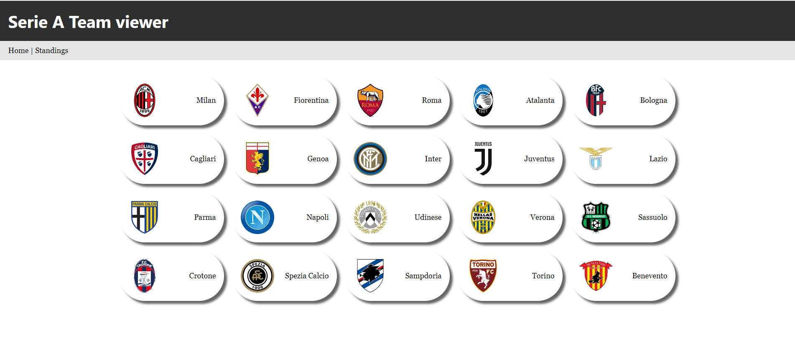
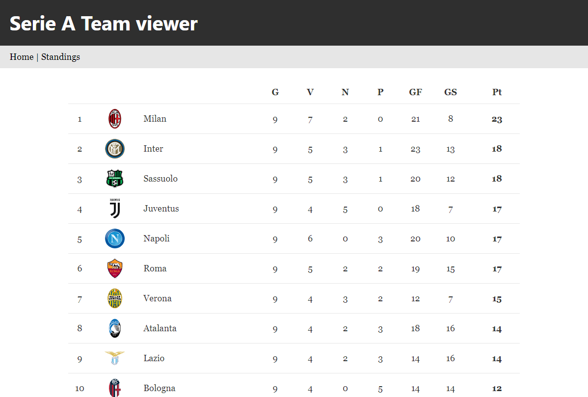
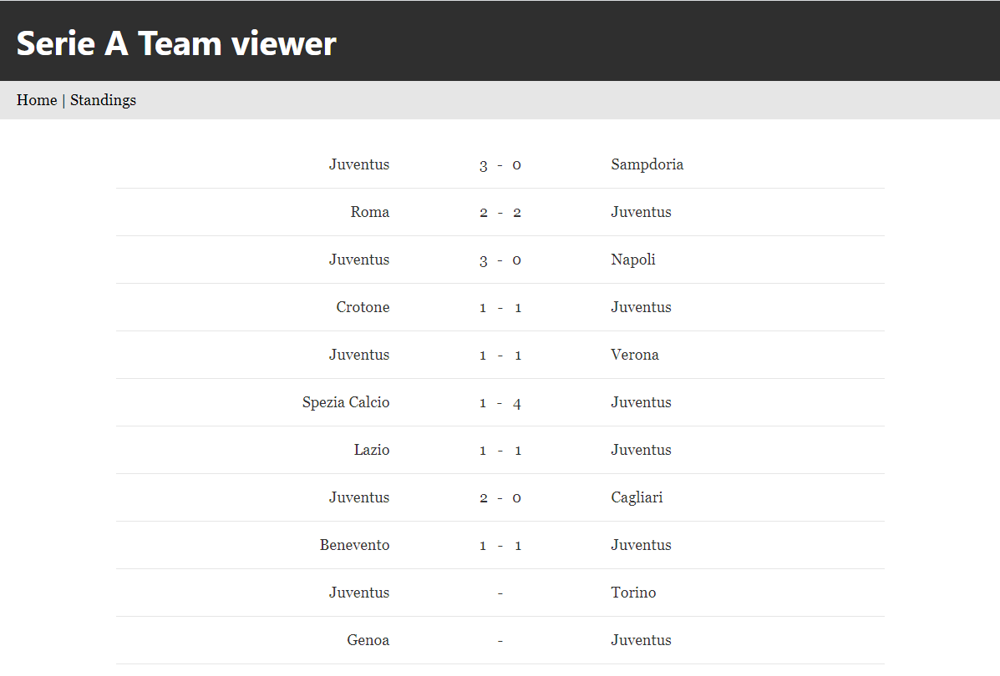

# Serie A Team Viewer

## About this project
This is a demo example of using GatsbyJS to implement a dummy web application that follow JAMStack principles. The main screens of the app are pre-rendered at build time with data gathered via a REST API service that provides all the football information needed for this use case so:
* Italian Serie A teams list
* Italian Serie A standings
* Italian Serie A matches schedule grouped by team

You can take a live tour of this app [here](https://main.d17o8ulagbjrod.amplifyapp.com/).

### Built with
* [Gatsby](https://www.gatsbyjs.com)'s default starter 
* [Football data](https://www.football-data.org/) API
* Typescript

## Usage
If you want to succesfully build the app you need first to create an account on [football-data.org](https://www.football-data.org/) in order to create a valid API token that you can use as environment variable (named `API_TOKEN`) for the API calls performed at build time by the Gatsby build process. For a local development it is possible to create a `.env` file with such variable and you are good to go. When you deploy the project on some remote server don't forget to create the environment variable following the documentation of your preferred hosting service.

## Available Scripts

### `npm run build`
Creates the production bundle of the app.

### `npm run develop`
Creates a development environment opening a local web server at `http://localhost:8000` with live reloading enabled.

### `npm run serve`
Needed to run a production build locally with a server opened at `http://localhost:9000`.

## Acknowledgements
* [football-data.org](https://www.football-data.org/)